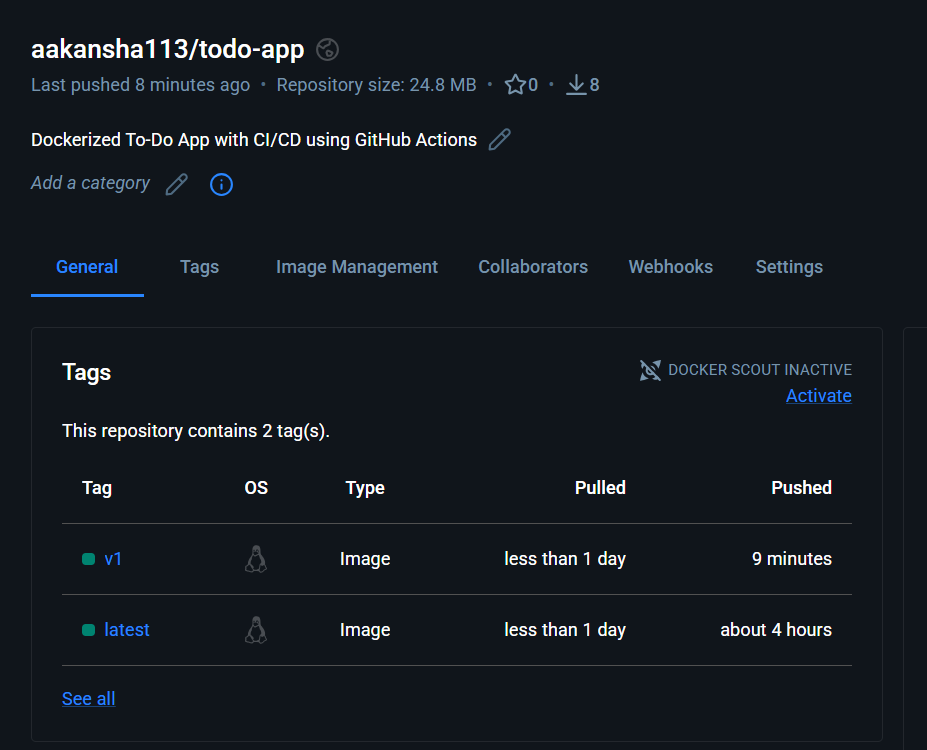

## To-Do Docker Webapp
Below is a ready-to-use README.md you can drop into your app/ Simple Frontend App.It describes the project, explains each file, and gives clear, step-by-step instructions for running locally and with Docker

A tiny static frontend app (HTML, CSS, JS) with a Dockerfile so you can build and run it inside a container.

##  📁 File structure
```
app/
├─ app.js         # your JavaScript
├─ index.html     # main HTML page
├─ styles.css     # styling
├─ Dockerfile     # container build instructions
├─ deployment.yml
├─ service.yml
└─ README.md      # this filefolder.

```
## Prerequisites

- Git (optional, if cloning)

- Docker (to build and run the container)Or a browser to open index.html for local testing

### 📥 Clone This Repository
To clone this portfolio on your local system, run:
```
git clone https://github.com/aakansha113/ToDo-Docker-Webappo.git
```


---

## ⚙️ CI/CD Pipeline (GitHub Actions)

This project uses GitHub Actions to automate Docker workflows.

### 🔄 Workflow Steps:

1. Code is pushed to the `main` branch  
2. GitHub Actions workflow is triggered  
3. Docker image is built  
4. Image is pushed to Docker Hub  

### 📄 Workflow File
.github/workflows/docker.yml

### 🔐 Required Secrets

Add in **GitHub → Settings → Secrets → Actions**:

- `DOCKER_USERNAME`
- `DOCKER_PASSWORD`

---

## 📦 Docker Image
aakansha113/todo-app:v1

Available on Docker Hub.

---

## 🐳 Run Using Docker

### Pull image
docker pull aakansha113/todo-app:latest

### Run container
docker run --name simple-frontend -d -p 8080:80 aakansha113/todo-app:latest


### Open in browser
http://localhost:8080

## Application UI
## Webpage-
<p align="center">
  
</p>

## Webpage with ToDo List-

<p align="center">
  
</p>

## Webpage of Docker Hub push by using Github Actions-

<p align="center">
  
</p>


### View container logs
```
docker logs -f simple-frontend
```
### Stop the container
```
docker stop simple-frontend
```
### Remove the container
```
docker rm simple-frontend
```
### Remove the image (if needed)
```
docker rmi simple-frontend-app:latest
```
# Troubleshooting — common issues

### 1-Container exits immediately

Check logs: 
```
docker logs <container-name>
```
Common causes:

1-Dockerfile CMD or ENTRYPOINT finishes immediately (no long-lived server). For static sites, ensure the image runs a server process (nginx, http-server, or similar).

2-Wrong working directory or missing files during build — verify Dockerfile copies all files.

3-Quick check: run container interactively to inspect:
```
docker run --rm -it simple-frontend-app:latest sh
```
4-Then look at file contents inside container.

### 2-Page not loading on localhost:8080

1-Confirm container is running: 
```
docker ps
```
2-Confirm port mapping: 
```
docker ps shows 0.0.0.0:8080->80/tcp
```
3-If using a VM or WSL, ensure Docker Host network is reachable.

### ⭐ Show Your Support
#### If you like this portfolio, feel free to ⭐ star the repo!


